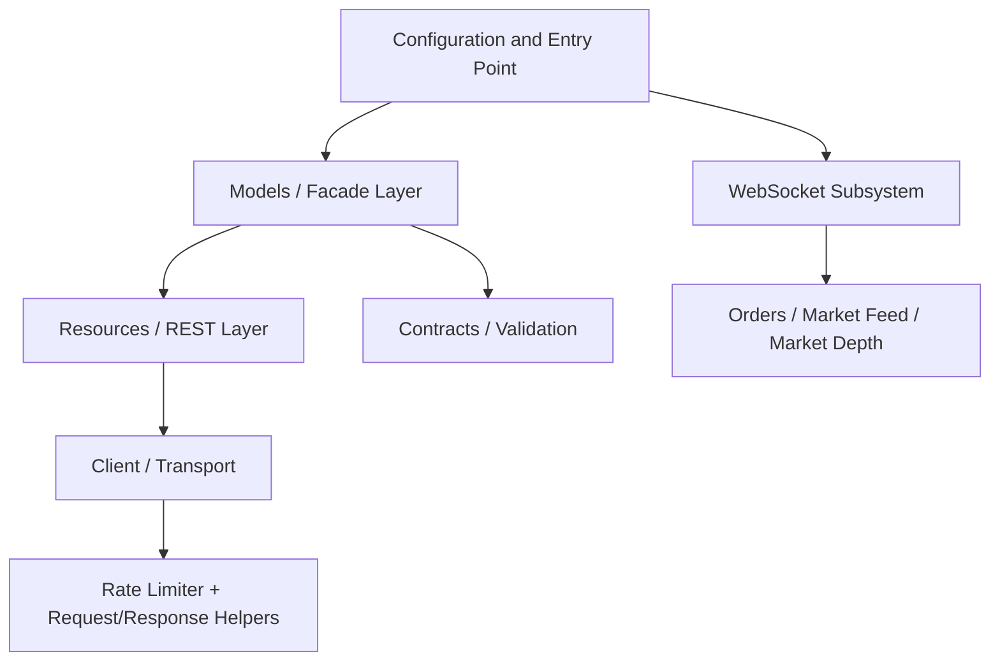

# DhanHQ — The Ruby SDK for Dhan API v2

[](https://rubygems.org/gems/DhanHQ)
[](https://github.com/shubhamtaywade82/dhanhq-client/actions/workflows/main.yml)
[](https://www.ruby-lang.org)
[](LICENSE.txt)

A production-grade Ruby SDK for the [Dhan trading API](https://dhanhq.co/docs/v2/), built for trading systems that need more than raw HTTP wrappers. If you are looking for a Ruby SDK for Dhan API, a Dhan trading SDK for Ruby, or a practical way to build algo trading systems with Dhan in Ruby, this gem is designed to be the default choice.

This gem sits closer to trading infrastructure than a thin API client: model-centric REST access, WebSocket runtime behavior, retry and auth handling, and safety rails for live order placement.

## 🚀 60-Second Quick Start

```ruby
# Gemfile
gem 'DhanHQ'
```

```ruby
require 'dhan_hq'

DhanHQ.configure do |c|
  c.client_id    = ENV["DHAN_CLIENT_ID"]
  c.access_token = ENV["DHAN_ACCESS_TOKEN"]
end

# You're live
positions = DhanHQ::Models::Position.all
holdings  = DhanHQ::Models::Holding.all
```

---

## Start Here

Pick the path that matches what you want to build:

- **I want prices and quotes fast** — start with [Market Feed WebSocket](#market-feed-ticker--quote--full) and [examples/portfolio_monitor.rb](examples/portfolio_monitor.rb)
- **I want to place orders safely** — start with [Order Safety](#order-safety) and [examples/basic_trading_bot.rb](examples/basic_trading_bot.rb)
- **I want streaming for a strategy** — start with [WebSockets](#websockets) and [examples/options_watchlist.rb](examples/options_watchlist.rb)
- **I want Rails integration** — jump to [docs/RAILS_INTEGRATION.md](docs/RAILS_INTEGRATION.md)
- **I want auth and token refresh** — jump to [docs/AUTHENTICATION.md](docs/AUTHENTICATION.md)

---

## Trust Signals

- **CI on supported Rubies** — GitHub Actions runs RSpec on Ruby 3.2.0 and 3.3.4, plus RuboCop on every push and pull request
- **Typed domain models** — Orders, Positions, Holdings, Funds, MarketFeed, OptionChain, Super Orders, and more expose a Ruby-first API instead of raw hashes
- **No real API calls in the default test suite** — WebMock blocks outbound HTTP and VCR covers cassette-backed integration paths
- **Auth lifecycle support** — static tokens, dynamic token providers, 401 retry with refresh hooks, and token sanitization in logs
- **WebSocket resilience** — reconnect, backoff, 429 cool-off, local connection cleanup, and dedicated market/order stream clients
- **Live trading guardrails** — order placement is blocked unless `LIVE_TRADING=true`, and order attempts emit structured audit logs

## Good Fit

- Trading bots that need typed order and portfolio workflows
- Rails or plain-Ruby apps that consume live market data
- Signal engines that combine historical bars with streaming ticks
- Backoffice or monitoring tools that need positions, holdings, funds, and order updates in one SDK

---

## Why This Over Thin Wrappers?

Official docs and thin SDKs can get you to raw requests quickly. This gem aims to get you to a maintainable Ruby trading system faster.

| Instead of | You get with DhanHQ |
| ---------- | ------------------- |
| JSON hashes and manual field mapping | Typed models with Ruby-first methods like `find`, `all`, `save`, and `cancel` |
| Rebuilding auth refresh in app code | Token providers, refresh hooks, and one-shot retry on 401 |
| Hand-rolled WS reconnect loops | Reconnect, backoff, 429 cool-off, and local cleanup helpers |
| Ad-hoc scripts with hidden risks | Live-trading guardrails and structured order audit logs |
| A generic HTTP client | A Dhan-focused Ruby SDK with examples for bots, monitors, and Rails apps |

---

## Why DhanHQ?

You could wire up Faraday and parse JSON yourself. Here's why you shouldn't:

| You get                        | Instead of                                    |
| ------------------------------ | --------------------------------------------- |
| ActiveModel-style `find`, `all`, `save`, `cancel` | Manual HTTP + JSON wrangling          |
| Typed models with validations  | Hash soup and runtime surprises               |
| Auto token refresh + retry-on-401 | Silent auth failures at 3 AM               |
| WebSocket reconnection with backoff | Dropped connections during volatile moves |
| 429 rate-limit cool-off        | Getting banned by the exchange                |
| Thread-safe, secure logging    | Leaked tokens in production logs              |

---

## Architecture At A Glance



Models own the Ruby API. Resources own HTTP calls. Contracts validate inputs. The transport layer handles auth, retries, rate limiting, and error mapping. WebSockets are a separate subsystem that shares configuration but not the REST stack.

For the full dependency flow and extension pattern, see [ARCHITECTURE.md](ARCHITECTURE.md).

---

## ✨ Key Features

- **ActiveRecord-style models** — `find`, `all`, `where`, `save`, `cancel` across Orders, Positions, Holdings, Funds, and more
- **Auto token refresh** — 401 retry with fresh token via provider callback
- **Thread-safe WebSocket client** — Orders, Market Feed, Market Depth with auto-reconnect
- **Exponential backoff + 429 cool-off** — no manual rate-limit management
- **Secure logging** — automatic token sanitization in all log output
- **Super Orders** — entry + stop-loss + target + trailing jump in one request
- **Instrument convenience methods** — `.ltp`, `.ohlc`, `.option_chain` directly on instruments
- **Order audit logging** — every order attempt logs machine, IP, environment, and correlation ID as structured JSON
- **Live trading guard** — prevents accidental order placement unless `ENV["LIVE_TRADING"]="true"`
- **Full REST coverage** — Orders, Trades, Forever Orders, Super Orders, Positions, Holdings, Funds, HistoricalData, OptionChain, MarketFeed, EDIS, Kill Switch, P&L Exit, Alert Orders, Margin Calculator
- **P&L Based Exit** — automatic position exit on profit/loss thresholds
- **Postback parser** — parse Dhan webhook payloads with `Postback.parse` and status predicates
- **EDIS model** — ORM-style T-PIN, form, and status inquiry for delivery instruction slips

---

## Operational Characteristics

- **`retry-on-401`** means one retry with a fresh token from your configured provider after the API rejects the current token
- **`429 cool-off`** means the client backs off instead of hammering the API when Dhan rate limits you
- **`auto-reconnect`** means WS clients try to recover dropped connections without forcing application code to rebuild subscriptions manually
- **`thread-safe`** means concurrent access is handled inside the WebSocket/client internals so multiple streams and callbacks do not race through shared mutable state casually
- **`secure logging`** means access tokens are sanitized from logs and order actions can be audited with structured metadata

These are reliability guarantees about behavior, not latency benchmarks. The gem is optimized for correctness and operational safety first.

---

## Installation

```ruby
# Gemfile (recommended)
gem 'DhanHQ'
```

```bash
bundle install
# or
gem install DhanHQ
```

> **Bleeding edge?** Use `gem 'DhanHQ', git: 'https://github.com/shubhamtaywade82/dhanhq-client.git', branch: 'main'` only if you need unreleased features.

**`bundle update` / `bundle install` warnings** — If you see "Local specification for rexml-3.2.8 has different dependencies" or "Unresolved or ambiguous specs during Gem::Specification.reset: psych", the bundle still completes successfully. To clear the rexml warning once, run: `gem cleanup rexml`. The psych message is a known Bundler quirk and can be ignored.

### ⚠️ Breaking Change (v2.1.5+)

The require statement changed:

```ruby
# Before         # Now
require 'DhanHQ'  →  require 'dhan_hq'
```

The gem name in your Gemfile stays `DhanHQ` — only the `require` changes.

---

## Configuration

### Static token (simplest)

```ruby
require 'dhan_hq'
DhanHQ.configure_with_env   # reads DHAN_CLIENT_ID + DHAN_ACCESS_TOKEN from ENV
```

| Variable             | Purpose                                |
| -------------------- | -------------------------------------- |
| `DHAN_CLIENT_ID`     | Your Dhan trading account client ID    |
| `DHAN_ACCESS_TOKEN`  | API token from the Dhan console        |

### Dynamic token (production / OAuth)

```ruby
DhanHQ.configure do |config|
  config.client_id = ENV["DHAN_CLIENT_ID"]
  config.access_token_provider = -> { YourTokenStore.active_token }
  config.on_token_expired = ->(error) { YourTokenStore.refresh! }  # optional
end
```

When the API returns 401, the client retries **once** with a fresh token from your provider.

> **Full details**: TOTP flows, partner mode, token endpoint bootstrap, auto-management — see [docs/AUTHENTICATION.md](docs/AUTHENTICATION.md).

---

## Order Safety

### Live Trading Guard

Order placement (`create`, `slicing`) is blocked unless you explicitly enable it:

```bash
# Production (Render, VPS, etc.)
LIVE_TRADING=true

# Development / Test (default — orders are blocked)
LIVE_TRADING=false   # or simply omit
```

Attempting to place an order without `LIVE_TRADING=true` raises `DhanHQ::LiveTradingDisabledError`.

### Order Audit Logging

Every order attempt (place, modify, slice) automatically logs a structured JSON line at WARN level:

```json
{
  "event": "DHAN_ORDER_ATTEMPT",
  "hostname": "DESKTOP-SHUBHAM",
  "env": "production",
  "ipv4": "122.171.22.40",
  "ipv6": "2401:4900:894c:8448:1da9:27f1:48e7:61be",
  "security_id": "11536",
  "correlation_id": "SCALPER_7af1",
  "timestamp": "2026-03-17T06:45:22Z"
}
```

This tells you instantly which machine, app, IP, and environment placed the order.

### Correlation ID Prefixes

Use per-app prefixes for instant source identification in the Dhan orderbook:

```ruby
# algo_scalper_api
correlation_id: "SCALPER_#{SecureRandom.hex(4)}"

# algo_trader_api
correlation_id: "TRADER_#{SecureRandom.hex(4)}"
```

The Dhan orderbook will show `SCALPER_7af1` or `TRADER_3bc9`, making the source obvious.

---

## REST API

### Orders — Place, Modify, Cancel

```ruby
order = DhanHQ::Models::Order.new(
  transaction_type: DhanHQ::Constants::TransactionType::BUY,
  exchange_segment: DhanHQ::Constants::ExchangeSegment::NSE_FNO,
  product_type: DhanHQ::Constants::ProductType::MARGIN,
  order_type: DhanHQ::Constants::OrderType::LIMIT,
  validity: DhanHQ::Constants::Validity::DAY,
  security_id:      "43492",
  quantity:         50,
  price:            100.0
)
order.save          # places the order
order.modify(price: 101.5)
order.cancel
```

### Positions, Holdings, Funds

```ruby
DhanHQ::Models::Position.all
DhanHQ::Models::Holding.all
DhanHQ::Models::Fund.balance
```

### Historical Data

```ruby
bars = DhanHQ::Models::HistoricalData.intraday(
  security_id:      "13",
  exchange_segment: DhanHQ::Constants::ExchangeSegment::IDX_I,
  instrument: DhanHQ::Constants::InstrumentType::INDEX,
  interval:         "5",
  from_date:        "2025-08-14",
  to_date:          "2025-08-18"
)
```

### Instrument Lookup

```ruby
nifty = DhanHQ::Models::Instrument.find("IDX_I", "NIFTY")
nifty.ltp           # last traded price
nifty.ohlc          # OHLC data
nifty.option_chain(expiry: "2025-02-28")
nifty.intraday(from_date: "2025-08-14", to_date: "2025-08-18", interval: "15")
```

---

## WebSockets

Three real-time feeds, all with **auto-reconnect**, **backoff**, **429 cool-off**, and **thread-safe operation**.

### Order Updates

```ruby
DhanHQ::WS::Orders.connect do |order_update|
  puts "#{order_update.order_no} → #{order_update.status} (#{order_update.traded_qty}/#{order_update.quantity})"
end
```

### Market Feed (Ticker / Quote / Full)

```ruby
client = DhanHQ::WS.connect(mode: :ticker) do |tick|
  puts "#{tick[:security_id]} = ₹#{tick[:ltp]}"
end

client.subscribe_one(segment: DhanHQ::Constants::ExchangeSegment::IDX_I, security_id: "13")   # NIFTY
client.subscribe_one(segment: DhanHQ::Constants::ExchangeSegment::IDX_I, security_id: "25")   # BANKNIFTY
```

### Market Depth

```ruby
reliance = DhanHQ::Models::Instrument.find("NSE_EQ", "RELIANCE")

DhanHQ::WS::MarketDepth.connect(symbols: [
  { symbol: "RELIANCE", exchange_segment: reliance.exchange_segment, security_id: reliance.security_id }
]) do |depth|
  puts "Best Bid: #{depth[:best_bid]} | Best Ask: #{depth[:best_ask]} | Spread: #{depth[:spread]}"
end
```

### Cleanup

```ruby
DhanHQ::WS.disconnect_all_local!   # kills all local WS connections
```

---

## Super Orders

Entry + target + stop-loss + trailing jump in a single request:

```ruby
DhanHQ::Models::SuperOrder.create(
  transaction_type: DhanHQ::Constants::TransactionType::BUY,
  exchange_segment: DhanHQ::Constants::ExchangeSegment::NSE_EQ,
  product_type: DhanHQ::Constants::ProductType::CNC,
  order_type: DhanHQ::Constants::OrderType::LIMIT,
  security_id:      "11536",
  quantity:         5,
  price:            1500,
  target_price:     1600,
  stop_loss_price:  1400,
  trailing_jump:    10
)
```

> **Full API reference** (modify, cancel, list, response schemas): [docs/SUPER_ORDERS.md](docs/SUPER_ORDERS.md)

---

## Real-World Example: NIFTY Trend Monitor

```ruby
require 'dhan_hq'

DhanHQ.configure_with_env

# 1. Check the trend using historical 5-min bars
bars = DhanHQ::Models::HistoricalData.intraday(
  security_id: "13", exchange_segment: DhanHQ::Constants::ExchangeSegment::IDX_I,
  instrument: DhanHQ::Constants::InstrumentType::INDEX, interval: "5",
  from_date: Date.today.to_s, to_date: Date.today.to_s
)

closes = bars.map { |b| b[:close] }
sma_20 = closes.last(20).sum / 20.0
trend  = closes.last > sma_20 ? :bullish : :bearish
puts "NIFTY trend: #{trend} (LTP: #{closes.last}, SMA20: #{sma_20.round(2)})"

# 2. Stream live ticks for real-time monitoring
client = DhanHQ::WS.connect(mode: :quote) do |tick|
  puts "NIFTY ₹#{tick[:ltp]} | Vol: #{tick[:vol]} | #{Time.now.strftime('%H:%M:%S')}"
end
client.subscribe_one(segment: DhanHQ::Constants::ExchangeSegment::IDX_I, security_id: "13")

# 3. On signal, place a super order with built-in risk management
# DhanHQ::Models::SuperOrder.create(
#   transaction_type: DhanHQ::Constants::TransactionType::BUY, exchange_segment: DhanHQ::Constants::ExchangeSegment::NSE_FNO, ...
#   target_price: entry + 50, stop_loss_price: entry - 30, trailing_jump: 5
# )

# 4. Clean shutdown
at_exit { DhanHQ::WS.disconnect_all_local! }
sleep   # keep the script alive
```

---

## Rails Integration

Need initializers, service objects, ActionCable wiring, and background workers? See the [Rails Integration Guide](docs/RAILS_INTEGRATION.md).

---

## Real-World Examples

These scripts are designed around user goals rather than API surfaces:

| Example | Use case |
| ------- | -------- |
| [examples/basic_trading_bot.rb](examples/basic_trading_bot.rb) | Pull historical data, evaluate a simple signal, and place a guarded order |
| [examples/portfolio_monitor.rb](examples/portfolio_monitor.rb) | Snapshot funds, holdings, and positions for a monitoring script |
| [examples/options_watchlist.rb](examples/options_watchlist.rb) | Build a live options watchlist with index quotes and option-chain context |
| [examples/market_feed_example.rb](examples/market_feed_example.rb) | Subscribe to major market indices over WebSocket |
| [examples/live_order_updates.rb](examples/live_order_updates.rb) | Track order lifecycle events in real time |

For search-driven discovery and onboarding content, see:

- [docs/HOW_TO_USE_DHAN_API_WITH_RUBY.md](docs/HOW_TO_USE_DHAN_API_WITH_RUBY.md)
- [docs/BUILD_A_TRADING_BOT_WITH_RUBY_AND_DHAN.md](docs/BUILD_A_TRADING_BOT_WITH_RUBY_AND_DHAN.md)

---

## Testing Philosophy

The test suite is designed to prove SDK behavior without depending on live Dhan credentials or unstable network calls.

- **Default mode is offline** — WebMock blocks real outbound HTTP in the suite
- **Recorded API flows use VCR** — cassette-backed specs cover request/response handling without turning the test suite into live API smoke tests
- **Coverage support exists locally** — run `COVERAGE=true bundle exec rspec` to generate SimpleCov coverage for model code
- **Live trading stays off by default** — specs that exercise order placement must explicitly opt into `LIVE_TRADING=true`

See [docs/TESTING_GUIDE.md](docs/TESTING_GUIDE.md) for console-based exploration and [spec/spec_helper.rb](spec/spec_helper.rb) for the enforced test boundaries.

---

## 📚 Documentation

| Guide | What it covers |
| ----- | -------------- |
| [Architecture](ARCHITECTURE.md) | Layering, dependency flow, design patterns, extension points |
| [Authentication](docs/AUTHENTICATION.md) | Token flows, TOTP, OAuth, auto-management |
| [Configuration Reference](docs/CONFIGURATION.md) | Full ENV matrix, logging, timeouts, available resources |
| [WebSocket Integration](docs/WEBSOCKET_INTEGRATION.md) | All WS types, architecture, best practices |
| [WebSocket Protocol](docs/WEBSOCKET_PROTOCOL.md) | Packet parsing, request codes, tick schema, exchange enums |
| [Rails WebSocket Guide](docs/RAILS_WEBSOCKET_INTEGRATION.md) | Rails-specific patterns, ActionCable |
| [Rails Integration](docs/RAILS_INTEGRATION.md) | Initializers, service objects, workers |
| [Standalone Ruby Guide](docs/STANDALONE_RUBY_WEBSOCKET_INTEGRATION.md) | Scripts, daemons, and long-running Ruby processes |
| [Super Orders API](docs/SUPER_ORDERS.md) | Full REST reference for super orders |
| [API Constants Reference](docs/CONSTANTS_REFERENCE.md) | All valid enums, exchange segments, and order parameters |
| [Data API Parameters](docs/DATA_API_PARAMETERS.md) | Historical data, option chain parameters |
| [Testing Guide](docs/TESTING_GUIDE.md) | WebSocket testing, model testing, console helpers |
| [Technical Analysis](docs/TECHNICAL_ANALYSIS.md) | Indicators, multi-timeframe aggregation |
| [Troubleshooting](docs/TROUBLESHOOTING.md) | 429 errors, reconnect, auth issues, debug logging |
| [How To Use Dhan API With Ruby](docs/HOW_TO_USE_DHAN_API_WITH_RUBY.md) | Search-friendly onboarding guide for Ruby users |
| [Build A Trading Bot With Ruby And Dhan](docs/BUILD_A_TRADING_BOT_WITH_RUBY_AND_DHAN.md) | End-to-end tutorial framing for strategy builders |
| [Release Guide](docs/RELEASE_GUIDE.md) | Versioning, publishing, changelog |

---

## Best Practices

- Keep `on(:tick)` handlers **non-blocking** — push heavy work to a queue/thread
- Use `mode: :quote` for most strategies; `:full` only if you need depth/OI
- Don't exceed **100 instruments per subscribe frame** (auto-chunked by the client)
- Call `DhanHQ::WS.disconnect_all_local!` on shutdown
- Avoid rapid connect/disconnect loops — the client already backs off on 429
- Use dynamic token providers in long-running systems instead of hardcoding expiring tokens

---

## Contributing

PRs welcome! Please include tests for new features. See [CHANGELOG.md](CHANGELOG.md) for recent changes.

```bash
bundle exec rake          # run tests
bundle exec rubocop       # lint
bin/console               # interactive console
```

## License

[MIT](LICENSE.txt)
