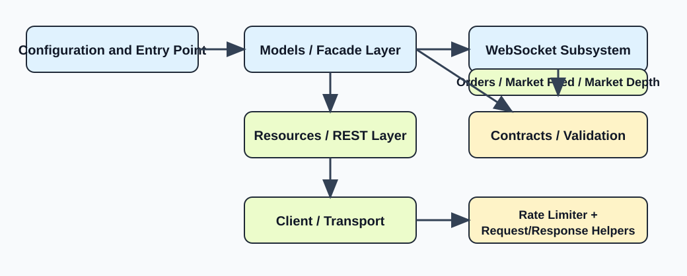

# DhanHQ — Ruby SDK & Client for Dhan API v2

[](https://rubygems.org/gems/DhanHQ)
[](https://github.com/shubhamtaywade82/dhanhq-client/actions/workflows/main.yml)
[](https://www.ruby-lang.org)
[](LICENSE.txt)

**DhanHQ** is a production-grade **Ruby SDK for the Dhan API v2** — build algorithmic trading systems, market data pipelines, and portfolio management tools for Indian markets (NSE, BSE, MCX) with clean Ruby abstractions, resilient WebSocket streaming, typed models, dry-validation contracts, and safety-focused order workflows for Ruby on Rails and standalone Ruby applications.

If you're looking for a Ruby gem for the Dhan trading API, this is built to be the default choice.

## Quick Start

```ruby
# Gemfile
gem 'DhanHQ'
```

```ruby
require 'dhan_hq'

DhanHQ.configure do |c|
  c.client_id    = ENV["DHAN_CLIENT_ID"]
  c.access_token = ENV["DHAN_ACCESS_TOKEN"]
end

# You're live — no manual HTTP, no JSON parsing
positions = DhanHQ::Models::Position.all
```

## Features

- **Typed models** for orders, positions, holdings, funds, and trades
- **WebSocket market feed** with auto-reconnect and exponential backoff
- **WebSocket order updates** — real-time execution events
- **Token lifecycle management** with automatic retry-on-401
- **dry-validation contracts** for every trading request
- **Rails integration** with ActionCable, config generators, and rake tasks
- **Safety rails** — validation before transport, no blind retries
- **Comprehensive docs** — 25+ guides covering auth, WebSocket, orders, super orders, TA, and testing
- **REST API** — orders, super orders, positions, holdings, funds, instruments, option chain, historical data, and more

```ruby
# Gemfile
gem 'DhanHQ'
```

```ruby
require 'dhan_hq'

DhanHQ.configure do |c|
  c.client_id    = ENV["DHAN_CLIENT_ID"]
  c.access_token = ENV["DHAN_ACCESS_TOKEN"]
end

# You're live — no manual HTTP, no JSON parsing
positions = DhanHQ::Models::Position.all
```

---

## Who This Is For

- Ruby developers building trading bots
- Rails apps integrating the Dhan API
- Algo trading systems that need clean abstractions over raw HTTP
- Long-running processes that rely on WebSocket market data

## Who This Is Not For

- One-off scripts where raw HTTP is enough
- Non-Ruby stacks

---

## Start Here (Pick Your Use Case)

Pick the path that matches what you want to build:

- **Get live prices fast** → [Market Feed WebSocket](#market-feed-ticker--quote--full)
- **Place orders safely** → [Order Safety](#order-safety)
- **Build a trading strategy** → [WebSockets](#websockets)
- **Build a trading bot** → [examples/basic_trading_bot.rb](examples/basic_trading_bot.rb)
- **Use with Rails** → [docs/RAILS_INTEGRATION.md](docs/RAILS_INTEGRATION.md)

---

## Trust Signals

- **CI on supported Rubies** — GitHub Actions runs RSpec on Ruby 3.2.0 and 3.3.4, plus RuboCop on every push and pull request
- **Typed domain models** — Orders, Positions, Holdings, Funds, MarketFeed, OptionChain, Super Orders, and more expose a Ruby-first API instead of raw hashes
- **No real API calls in the default test suite** — WebMock blocks outbound HTTP and VCR covers cassette-backed integration paths
- **Auth lifecycle support** — static tokens, dynamic token providers, 401 retry with refresh hooks, and token sanitization in logs
- **WebSocket resilience** — reconnect, backoff, 429 cool-off, local connection cleanup, and dedicated market/order stream clients
- **Live trading guardrails** — order placement is blocked unless `LIVE_TRADING=true`, and order attempts emit structured audit logs

---

## Why Not a Thin Wrapper?

Most API clients give you HTTP access. DhanHQ gives you a working Ruby system.

| Instead of | You get |
| ---------- | -------- |
| JSON parsing and manual field mapping | Typed models |
| Manual auth refresh | Built-in token lifecycle |
| Fragile WebSocket code | Auto-reconnect, backoff, and 429 handling |
| Risky order scripts | Live trading guardrails and audit logs |

---

## Architecture At A Glance



Models own the Ruby API. Resources own HTTP calls. Contracts validate inputs. The transport layer handles auth, retries, rate limiting, and error mapping. WebSockets are a separate subsystem that shares configuration but not the REST stack.

For the full dependency flow and extension pattern, see [ARCHITECTURE.md](ARCHITECTURE.md).

---

## ✨ Key Features

- **ActiveRecord-style models** — `find`, `all`, `where`, `save`, `cancel` across Orders, Positions, Holdings, Funds, and more
- **Auto token refresh** — 401 retry with fresh token via provider callback
- **Thread-safe WebSocket client** — Orders, Market Feed, Market Depth with auto-reconnect
- **Exponential backoff + 429 cool-off** — no manual rate-limit management
- **Secure logging** — automatic token sanitization in all log output
- **Super Orders** — entry + stop-loss + target + trailing jump in one request
- **Instrument convenience methods** — `.ltp`, `.ohlc`, `.option_chain` directly on instruments
- **Order audit logging** — every order attempt logs machine, IP, environment, and correlation ID as structured JSON
- **Live trading guard** — prevents accidental order placement unless `ENV["LIVE_TRADING"]="true"`
- **Dry-run mode** — `config.dry_run = true` validates and logs every write while reads stay live, so a full strategy can be rehearsed against real prices
- **No duplicate orders on retry** — transient failures on order writes are surfaced, not blindly retried
- **Global Stocks (US equities)** — separate order book, holdings, trades, USD funds, market status, charge estimator and margin calculator
- **Basket orders** — up to 15 orders in a single request, with per-leg acceptance results
- **Full REST coverage** — Orders, Trades, Forever Orders, Super Orders, Multi (basket) Orders, Positions, Holdings, Funds, HistoricalData, OptionChain, MarketFeed, EDIS, Kill Switch, P&L Exit, Alert Orders, Margin Calculator, IP Setup, Global Stocks
- **P&L Based Exit** — automatic position exit on profit/loss thresholds
- **Postback parser** — parse Dhan webhook payloads with `Postback.parse` and status predicates
- **EDIS model** — ORM-style T-PIN, form, and status inquiry for delivery instruction slips

---

## Reliability & Safety

- retry-on-401 with token refresh
- WebSocket auto-reconnect, backoff, and automatic re-subscription
- 429 rate-limit protection
- live trading guard via `LIVE_TRADING=true`
- structured order audit logs
- dry-run mode via `DHAN_DRY_RUN=true`
- order writes are never silently retried, so a timeout cannot become two orders

See [ARCHITECTURE.md](ARCHITECTURE.md), [docs/TESTING_GUIDE.md](docs/TESTING_GUIDE.md), and [docs/TROUBLESHOOTING.md](docs/TROUBLESHOOTING.md) for the deeper implementation details.

---

## Installation

```ruby
# Gemfile (recommended)
gem 'DhanHQ'
```

```bash
bundle install
# or
gem install DhanHQ
```

> **Bleeding edge?** Use `gem 'DhanHQ', git: 'https://github.com/shubhamtaywade82/dhanhq-client.git', branch: 'main'` only if you need unreleased features.

**`bundle update` / `bundle install` warnings** — If you see "Local specification for rexml-3.2.8 has different dependencies" or "Unresolved or ambiguous specs during Gem::Specification.reset: psych", the bundle still completes successfully. To clear the rexml warning once, run: `gem cleanup rexml`. The psych message is a known Bundler quirk and can be ignored.

### Gem name vs require path

RubyGems normalizes names, so `DhanHQ` and `dhan_hq` refer to the same slot — the published name stays `DhanHQ` and will never change. The require path has used snake_case since v2.1.5:

```ruby
# Gemfile              # Ruby file
gem 'DhanHQ'           require 'dhan_hq'
```

### Optional features

The core SDK (`require 'dhan_hq'`) only loads the API client. Technical analysis and the options advisor are opt-in:

```ruby
require 'dhan_hq/analysis'  # DhanHQ::Analysis::OptionsBuyingAdvisor, MultiTimeframeAnalyzer
require 'dhan_hq/ta'        # TA::TechnicalAnalysis, TA::Fetcher, TA::Candles
```

---

## Configuration

### Static token (simplest)

```ruby
require 'dhan_hq'
DhanHQ.configure_with_env   # reads DHAN_CLIENT_ID + DHAN_ACCESS_TOKEN from ENV
```

| Variable             | Purpose                                |
| -------------------- | -------------------------------------- |
| `DHAN_CLIENT_ID`     | Your Dhan trading account client ID    |
| `DHAN_ACCESS_TOKEN`  | API token from the Dhan console        |

### Dynamic token (production / OAuth)

```ruby
DhanHQ.configure do |config|
  config.client_id = ENV["DHAN_CLIENT_ID"]
  config.access_token_provider = -> { YourTokenStore.active_token }
  config.on_token_expired = ->(error) { YourTokenStore.refresh! }  # optional
end
```

When the API returns 401, the client retries **once** with a fresh token from your provider.

> **Full details**: TOTP flows, partner mode, token endpoint bootstrap, auto-management — see [docs/AUTHENTICATION.md](docs/AUTHENTICATION.md).

---

## Order Safety

### Live Trading Guard

Order placement (`create`, `slicing`) is blocked unless you explicitly enable it:

```bash
# Production (Render, VPS, etc.)
LIVE_TRADING=true

# Development / Test (default — orders are blocked)
LIVE_TRADING=false   # or simply omit
```

Attempting to place an order without `LIVE_TRADING=true` raises `DhanHQ::LiveTradingDisabledError`.

### Dry-Run Mode

`dry_run` suppresses every request that would change account state — order placement,
modification, cancellation, position exits, kill switch, P&L exit — while letting reads
through untouched. Market data, the option chain, positions and holdings stay live, so a
strategy can be rehearsed end-to-end against real prices without any risk of an order
reaching the exchange.

```ruby
DhanHQ.configure do |config|
  config.dry_run = true      # or DHAN_DRY_RUN=true
end

order = DhanHQ::Models::Order.place(
  transaction_type: DhanHQ::Constants::TransactionType::BUY,
  exchange_segment: DhanHQ::Constants::ExchangeSegment::NSE_EQ,
  product_type: DhanHQ::Constants::ProductType::INTRADAY,
  order_type: DhanHQ::Constants::OrderType::LIMIT,
  validity: DhanHQ::Constants::Validity::DAY,
  security_id: "11536", quantity: 5, price: 1500.0
)
```

Suppressed writes are logged at WARN level with the full payload, and order placements come
back with a simulated `orderId` so downstream code paths run to completion:

```json
{ "event": "DHAN_DRY_RUN", "method": "POST", "path": "/v2/orders", "payload": { "…": "…" } }
```

Note that a POST is not automatically a write on this API: the option chain, market feed,
historical charts and the margin calculators are read-only POSTs, and dry-run leaves them
alone.

This works through the high-level models too, not just `Client#request`. Because
`Order.place` re-fetches after placing, the SDK records each simulated order and replays reads
for its `DRYRUN-…` id locally — so a rehearsal issues no request for a fake order, and the
model you get back carries the fields you submitted:

```ruby
order.order_id    # => "DRYRUN-9F7BEB55D0F9"
order.security_id # => "11536"
```

`dry_run` complements `Agent::OrderPreview` — preview validates a single order and returns a
summary, while `dry_run` covers every write path in the SDK, including skills and the MCP
tools.

### Order Retries and Duplicate Protection

The DhanHQ API has no idempotency key. A `POST /v2/orders` that times out may well have
reached the exchange, so retrying it can place a second, real order. By default this SDK
therefore **does not** retry non-idempotent writes — the transient error is raised to you:

```ruby
begin
  DhanHQ::Models::Order.place(...)
rescue DhanHQ::NetworkError
  # The order may or may not have been accepted. Reconcile before resubmitting.
end
```

Reads, and read-only POSTs like the option chain, are still retried with exponential backoff.

To reconcile after a timeout, place orders with a correlation id and look the order up by it:

```ruby
DhanHQ.configure do |config|
  config.auto_correlation_id = true   # or DHAN_AUTO_CORRELATION_ID=true
end
```

With this on, any order placement missing a `correlationId` gets one (`dhq-<hex>`), which you
can then resolve via `GET /v2/orders/external/{correlation-id}`:

```ruby
DhanHQ::Resources::Orders.new.by_correlation("dhq-2f9c1a…")
```

It is off by default because it changes the request body, which would break callers that match
recorded fixtures on the exact payload. An explicit `correlation_id` is always preserved.

If you would rather have the old auto-retry behaviour, opt back in — accepting the duplicate
risk:

```ruby
DhanHQ.configure { |config| config.retry_non_idempotent_writes = true }
```

### Explicit Failures: Bang Variants

Every write method has a `!` variant that raises instead of returning a falsy value:

```ruby
order = DhanHQ::Models::Order.place!(params)   # raises DhanHQ::OrderError on failure
order.cancel!                                  # raises if the exchange did not cancel
```

This exists because the non-bang methods do not agree on how to report failure — some
return `nil`, some `false`, some a `DhanHQ::ErrorObject` — so a caller cannot write one
error branch:

```ruby
# Before: which falsy thing came back depends on which method and which failure
order = DhanHQ::Models::Order.place(params)
return unless order            # nil on rejection

result = DhanHQ::Models::MultiOrder.place(legs)
return if result.is_a?(DhanHQ::ErrorObject)   # truthy! `unless result` would not catch this
```

`DhanHQ::OrderError` descends from `DhanHQ::Error`, so an existing `rescue DhanHQ::Error`
keeps working. The non-bang methods are unchanged, so adopting this is per call site:

```ruby
begin
  DhanHQ::Models::Order.place!(params)
rescue DhanHQ::OrderError => e
  logger.error(e.message)   # carries the API's diagnostics
end
```

When a non-bang write reports failure, the SDK logs once per call site to help you find
what needs migrating before 4.0.0 changes the return value:

```
[DhanHQ] DEPRECATION: DhanHQ::Models::Order.place reported failure as nil. ...
Use DhanHQ::Models::Order.place! to get a DhanHQ::OrderError instead, or set
config.warn_on_ambiguous_write_failure = false to silence this.
```

It fires once per call site per process, never alters a return value, never raises, and
goes quiet once you switch that site to the bang variant. To silence it entirely:

```ruby
DhanHQ.configure { |c| c.warn_on_ambiguous_write_failure = false }   # or DHAN_WARN_AMBIGUOUS_WRITE_FAILURE=false
```

Available on `Order`, `SuperOrder`, `ForeverOrder`, `IcebergOrder`, `TwapOrder`,
`AlertOrder`, `PnlExit`, `MultiOrder` and `GlobalStocks::Order`. The non-bang methods are
planned to converge on `ErrorObject` in 4.0.0 — see the CHANGELOG for the staged plan.

### Order Audit Logging

Every order attempt (place, modify, slice) automatically logs a structured JSON line at WARN level:

```json
{
  "event": "DHAN_ORDER_ATTEMPT",
  "hostname": "DESKTOP-SHUBHAM",
  "env": "production",
  "ipv4": "122.171.22.40",
  "ipv6": "2401:4900:894c:8448:1da9:27f1:48e7:61be",
  "security_id": "11536",
  "correlation_id": "SCALPER_7af1",
  "timestamp": "2026-03-17T06:45:22Z"
}
```

This tells you instantly which machine, app, IP, and environment placed the order.

### Correlation ID Prefixes

Use per-app prefixes for instant source identification in the Dhan orderbook:

```ruby
# algo_scalper_api
correlation_id: "SCALPER_#{SecureRandom.hex(4)}"

# algo_trader_api
correlation_id: "TRADER_#{SecureRandom.hex(4)}"
```

The Dhan orderbook will show `SCALPER_7af1` or `TRADER_3bc9`, making the source obvious.

---

## REST API

### Orders — Place, Modify, Cancel

```ruby
order = DhanHQ::Models::Order.new(
  transaction_type: DhanHQ::Constants::TransactionType::BUY,
  exchange_segment: DhanHQ::Constants::ExchangeSegment::NSE_FNO,
  product_type: DhanHQ::Constants::ProductType::MARGIN,
  order_type: DhanHQ::Constants::OrderType::LIMIT,
  validity: DhanHQ::Constants::Validity::DAY,
  security_id:      "43492",
  quantity:         50,
  price:            100.0
)
order.save          # places the order
order.modify(price: 101.5)
order.cancel
```

### Positions, Holdings, Funds

```ruby
DhanHQ::Models::Position.all
DhanHQ::Models::Holding.all
DhanHQ::Models::Funds.balance
```

### Historical Data

```ruby
bars = DhanHQ::Models::HistoricalData.intraday(
  security_id:      "13",
  exchange_segment: DhanHQ::Constants::ExchangeSegment::IDX_I,
  instrument: DhanHQ::Constants::InstrumentType::INDEX,
  interval:         "5",
  from_date:        "2025-08-14",
  to_date:          "2025-08-18"
)
```

### Instrument Lookup

```ruby
nifty = DhanHQ::Models::Instrument.find("IDX_I", "NIFTY")
nifty.ltp           # last traded price
nifty.ohlc          # OHLC data
nifty.option_chain(expiry: "2025-02-28")
nifty.intraday(from_date: "2025-08-14", to_date: "2025-08-18", interval: "15")
```

---

## WebSockets

Three real-time feeds, all with **auto-reconnect**, **backoff**, **429 cool-off**, and **thread-safe operation**.

### Order Updates

```ruby
DhanHQ::WS::Orders.connect do |order_update|
  puts "#{order_update.order_no} → #{order_update.status} (#{order_update.traded_qty}/#{order_update.quantity})"
end
```

### Market Feed (Ticker / Quote / Full)

```ruby
client = DhanHQ::WS.connect(mode: :ticker) do |tick|
  puts "#{tick[:security_id]} = ₹#{tick[:ltp]}"
end

client.subscribe_one(segment: DhanHQ::Constants::ExchangeSegment::IDX_I, security_id: "13")   # NIFTY
client.subscribe_one(segment: DhanHQ::Constants::ExchangeSegment::IDX_I, security_id: "25")   # BANKNIFTY
```

### Market Depth

```ruby
reliance = DhanHQ::Models::Instrument.find("NSE_EQ", "RELIANCE")

DhanHQ::WS::MarketDepth.connect(symbols: [
  { symbol: "RELIANCE", exchange_segment: reliance.exchange_segment, security_id: reliance.security_id }
]) do |depth|
  puts "Best Bid: #{depth[:best_bid]} | Best Ask: #{depth[:best_ask]} | Spread: #{depth[:spread]}"
end
```

### Lifecycle Hooks and Health Checks

Subscriptions are restored automatically on reconnect — the server keeps no subscription state
across connections, so the client replays the desired set on every new session. Hook `:reconnect`
when you need to re-seed derived state (candle builders, caches) after a gap:

```ruby
client = DhanHQ::WS.connect(mode: :ticker) { |tick| handle(tick) }

client.on(:open)      { |info| logger.info "feed open, #{info[:resubscribed].size} restored" }
client.on(:reconnect) { |info| logger.warn "reconnect ##{info[:attempt]}"; candles.reset! }
client.on(:close)     { |info| logger.warn "closed #{info[:code]} #{info[:reason]}" }
client.on(:error)     { |message| logger.error message }
```

A feed can be connected and still be dead — the socket stays open while the server stops
publishing. For long-running daemons, watch frame arrival rather than the socket alone:

```ruby
client.connected?                  # socket state
client.healthy?                    # connected AND delivering frames (default: within 45s)
client.healthy?(stale_after: 20)   # tighter threshold
client.last_message_at             # Time of the most recent frame
client.seconds_since_last_message
client.reconnect_count
client.subscriptions               # ["NSE_EQ:11536", …] — survives reconnects

client.health
# => { mode: :ticker, started: true, connected: true, healthy: true,
#      connected_at: …, last_message_at: …, seconds_since_last_message: 0.4,
#      reconnect_count: 2, subscription_count: 37 }
```

`health` is shaped for a monitoring endpoint or a periodic log line.

> **Connection limit:** Dhan allows **5 concurrent WebSocket connections per client id**, with
> 5,000 instruments per connection and 100 instruments per subscribe frame. Running several
> strategies in separate processes counts against the same limit — a 6th connection is refused.

### Cleanup

```ruby
DhanHQ::WS.disconnect_all_local!   # kills all local WS connections
```

---

## Super Orders

Entry + target + stop-loss + trailing jump in a single request:

```ruby
DhanHQ::Models::SuperOrder.create(
  transaction_type: DhanHQ::Constants::TransactionType::BUY,
  exchange_segment: DhanHQ::Constants::ExchangeSegment::NSE_EQ,
  product_type: DhanHQ::Constants::ProductType::CNC,
  order_type: DhanHQ::Constants::OrderType::LIMIT,
  security_id:      "11536",
  quantity:         5,
  price:            1500,
  target_price:     1600,
  stop_loss_price:  1400,
  trailing_jump:    10
)
```

> **Full API reference** (modify, cancel, list, response schemas): [docs/SUPER_ORDERS.md](docs/SUPER_ORDERS.md)

---

## Basket Orders (Multi Order)

Place up to 15 unconditional orders in a single request. Each leg carries a `sequence` that
identifies it in the response, so partial acceptance is visible:

```ruby
result = DhanHQ::Models::MultiOrder.place([
  { sequence: "1", transaction_type: "BUY", exchange_segment: "NSE_EQ", product_type: "CNC",
    order_type: "LIMIT", validity: "DAY", security_id: "11536", quantity: 1, price: 1500.0 },
  { sequence: "2", transaction_type: "BUY", exchange_segment: "NSE_EQ", product_type: "CNC",
    order_type: "MARKET", validity: "DAY", security_id: "1333", quantity: 2 }
])

result.all_accepted?              # => true
result.order_ids                  # => ["112111182198", "112111182199"]
result.rejected                   # legs the exchange refused
result.partially_accepted?        # some in, some out
result.for_sequence("1").order_id # look a leg up by its sequence
```

Every leg is validated before anything is sent, and each one gets its own audit log line.
Requires `LIVE_TRADING=true` like any other order path.

---

## Global Stocks (US Equities)

US stocks are a **separate book** from domestic NSE/BSE trading: their own order book,
holdings, trades, and a USD fund limit. They are namespaced under `GlobalStocks` so a USD
position can never be mistaken for an INR one.

```ruby
# Is the US market open?
DhanHQ::Models::GlobalStocks::MarketStatus.fetch.open?

# USD balance and portfolio
DhanHQ::Models::GlobalStocks::Funds.fetch.available_cash
DhanHQ::Models::GlobalStocks::Holding.all.each do |h|
  puts "#{h.trading_symbol}: #{h.quantity} @ $#{h.avg_cost_price} (#{h.gain_percentage}%)"
end
DhanHQ::Models::GlobalStocks::Holding.total_current_value
```

### Placing US orders

Global Stocks orders carry **no exchange segment, product type, or validity** — and quantity
is a float, because fractional shares are supported:

```ruby
DhanHQ::Models::GlobalStocks::Order.place(
  transaction_type: DhanHQ::Constants::TransactionType::BUY,
  order_type:       DhanHQ::Constants::GlobalStocks::OrderType::LIMIT,
  security_id:      "AAPL",
  quantity:         0.5,          # fractional shares
  price:            180.0
)
```

`AMOUNT` is a notional order type unique to this book — you name a dollar value instead of a
share count:

```ruby
DhanHQ::Models::GlobalStocks::Order.place(
  transaction_type: DhanHQ::Constants::TransactionType::BUY,
  order_type:       DhanHQ::Constants::GlobalStocks::OrderType::AMOUNT,
  security_id:      "AAPL",
  amount:           500.0         # buy $500 worth
)
```

### Pre-trade checks

```ruby
params = { security_id: "AAPL", transaction_type: "BUY", price: 180.0, quantity: 10 }

estimate = DhanHQ::Models::GlobalStocks::OrderEstimate.calculate(params)
estimate.total_charges           # brokerage + exchange + GST + turnover + other

margin = DhanHQ::Models::GlobalStocks::Margin.calculate(params)
margin.sufficient?               # false when the account is short
margin.total_margin
```

### Order and trade books

```ruby
DhanHQ::Models::GlobalStocks::Order.all              # today's US order book
DhanHQ::Models::GlobalStocks::Order.find(order_id)
DhanHQ::Models::GlobalStocks::Trade.all              # today's US fills
DhanHQ::Models::GlobalStocks::Trade.find_by_security_id("AAPL")
```

Writes go through the same `LIVE_TRADING` gate, audit logging, and dry-run handling as
domestic orders. The pre-trade `Risk::Pipeline` is deliberately **not** applied: its checks
resolve instruments from the Indian scrip master and encode NSE/BSE rules (lot sizes, ASM/GSM
surveillance, F&O product support, IST market hours), none of which apply to US equities. Use
`Margin#sufficient?` and `OrderEstimate` as the pre-trade gate here instead.

The Global Stocks live feed (`wss://global-stocks-api-feed.dhan.co`, segment `INX_EQ`, code
`14`) is documented in `DhanHQ::Constants::GlobalStocks`; its binary packet decoder is not yet
implemented.

---

## Real-World Example: NIFTY Trend Monitor

```ruby
require 'dhan_hq'

DhanHQ.configure_with_env

# 1. Check the trend using historical 5-min bars
bars = DhanHQ::Models::HistoricalData.intraday(
  security_id: "13", exchange_segment: DhanHQ::Constants::ExchangeSegment::IDX_I,
  instrument: DhanHQ::Constants::InstrumentType::INDEX, interval: "5",
  from_date: Date.today.to_s, to_date: Date.today.to_s
)

closes = bars.map { |b| b[:close] }
sma_20 = closes.last(20).sum / 20.0
trend  = closes.last > sma_20 ? :bullish : :bearish
puts "NIFTY trend: #{trend} (LTP: #{closes.last}, SMA20: #{sma_20.round(2)})"

# 2. Stream live ticks for real-time monitoring
client = DhanHQ::WS.connect(mode: :quote) do |tick|
  puts "NIFTY ₹#{tick[:ltp]} | Vol: #{tick[:vol]} | #{Time.now.strftime('%H:%M:%S')}"
end
client.subscribe_one(segment: DhanHQ::Constants::ExchangeSegment::IDX_I, security_id: "13")

# 3. On signal, place a super order with built-in risk management
# DhanHQ::Models::SuperOrder.create(
#   transaction_type: DhanHQ::Constants::TransactionType::BUY, exchange_segment: DhanHQ::Constants::ExchangeSegment::NSE_FNO, ...
#   target_price: entry + 50, stop_loss_price: entry - 30, trailing_jump: 5
# )

# 4. Clean shutdown
at_exit { DhanHQ::WS.disconnect_all_local! }
sleep   # keep the script alive
```

---

## Rails Integration

Need initializers, service objects, ActionCable wiring, and background workers? See the [Rails Integration Guide](docs/RAILS_INTEGRATION.md).

---

## Real-World Examples

These scripts are designed around user goals rather than API surfaces:

| Example | What it covers |
| ------- | --------------- |
| [examples/basic_trading_bot.rb](examples/basic_trading_bot.rb) | Trading bot scaffold with live-trading guard |
| [examples/comprehensive_websocket_examples.rb](examples/comprehensive_websocket_examples.rb) | WebSocket mode coverage and timeout handling |
| [examples/options_watchlist.rb](examples/options_watchlist.rb) | Build a live options watchlist with index quotes and option-chain context |
| [examples/market_feed_example.rb](examples/market_feed_example.rb) | Subscribe to major market indices over WebSocket |
| [examples/market_depth_example.rb](examples/market_depth_example.rb) | Market depth streaming example |
| [examples/live_order_updates.rb](examples/live_order_updates.rb) | Track order lifecycle events in real time |
| [examples/order_update_example.rb](examples/order_update_example.rb) | Single-session order-update flow |
| [examples/portfolio_monitor.rb](examples/portfolio_monitor.rb) | Snapshot funds, holdings, and positions for a monitoring script |
| [examples/trading_fields_example.rb](examples/trading_fields_example.rb) | Dhan order-field mappings and constants example |
| [examples/instrument_finder_test.rb](examples/instrument_finder_test.rb) | Instrument search/resolution troubleshooting |

For search-driven discovery and onboarding content, see:

- [docs/HOW_TO_USE_DHAN_API_WITH_RUBY.md](docs/HOW_TO_USE_DHAN_API_WITH_RUBY.md)
- [docs/BUILD_A_TRADING_BOT_WITH_RUBY_AND_DHAN.md](docs/BUILD_A_TRADING_BOT_WITH_RUBY_AND_DHAN.md)

## Use Case Guides

- [docs/DHAN_API_RUBY_EXAMPLES.md](docs/DHAN_API_RUBY_EXAMPLES.md)
- [docs/DHAN_WEBSOCKET_RUBY_GUIDE.md](docs/DHAN_WEBSOCKET_RUBY_GUIDE.md)
- [docs/BEST_WAY_TO_USE_DHAN_API_IN_RUBY.md](docs/BEST_WAY_TO_USE_DHAN_API_IN_RUBY.md)
- [docs/DHAN_RUBY_QA.md](docs/DHAN_RUBY_QA.md)

---

## 📚 Documentation

| Guide | What it covers |
| ----- | -------------- |
| [Architecture](ARCHITECTURE.md) | Layering, dependency flow, design patterns, extension points |
| [Authentication](docs/AUTHENTICATION.md) | Token flows, TOTP, OAuth, auto-management |
| [Configuration Reference](docs/CONFIGURATION.md) | Full ENV matrix, logging, timeouts, available resources |
| [WebSocket Integration](docs/WEBSOCKET_INTEGRATION.md) | All WS types, architecture, best practices |
| [WebSocket Protocol](docs/WEBSOCKET_PROTOCOL.md) | Packet parsing, request codes, tick schema, exchange enums |
| [Rails WebSocket Guide](docs/RAILS_WEBSOCKET_INTEGRATION.md) | Rails-specific patterns, ActionCable |
| [Rails Integration](docs/RAILS_INTEGRATION.md) | Initializers, service objects, workers |
| [Standalone Ruby Guide](docs/STANDALONE_RUBY_WEBSOCKET_INTEGRATION.md) | Scripts, daemons, and long-running Ruby processes |
| [Super Orders API](docs/SUPER_ORDERS.md) | Full REST reference for super orders |
| [API Constants Reference](docs/CONSTANTS_REFERENCE.md) | All valid enums, exchange segments, and order parameters |
| [Data API Parameters](docs/DATA_API_PARAMETERS.md) | Historical data, option chain parameters |
| [Testing Guide](docs/TESTING_GUIDE.md) | WebSocket testing, model testing, console helpers |
| [Technical Analysis](docs/TECHNICAL_ANALYSIS.md) | Indicators, multi-timeframe aggregation |
| [Troubleshooting](docs/TROUBLESHOOTING.md) | 429 errors, reconnect, auth issues, debug logging |
| [How To Use Dhan API With Ruby](docs/HOW_TO_USE_DHAN_API_WITH_RUBY.md) | Search-friendly onboarding guide for Ruby users |
| [Build A Trading Bot With Ruby And Dhan](docs/BUILD_A_TRADING_BOT_WITH_RUBY_AND_DHAN.md) | End-to-end tutorial framing for strategy builders |
| [Dhan API Ruby Examples](docs/DHAN_API_RUBY_EXAMPLES.md) | Small answer-style snippets for common Ruby + Dhan tasks |
| [Dhan WebSocket Ruby Guide](docs/DHAN_WEBSOCKET_RUBY_GUIDE.md) | Query-shaped guide for Dhan market data streaming in Ruby |
| [Best Way To Use Dhan API In Ruby](docs/BEST_WAY_TO_USE_DHAN_API_IN_RUBY.md) | Comparison-focused guide for SDK vs raw HTTP |
| [Dhan Ruby Q&A](docs/DHAN_RUBY_QA.md) | Publish-ready answers for common Dhan + Ruby questions |
| [Release Guide](docs/RELEASE_GUIDE.md) | Versioning, publishing, changelog |

---

## MCP Server (AI Agent Integration)

DhanHQ includes a built-in [Model Context Protocol](https://modelcontextprotocol.io) server that lets AI coding agents (Claude Code, Codex, OpenCode, Cursor) interact with your Dhan account directly from the editor or CLI.

### Quick Start

```bash
# 1. Configure credentials
export DHAN_CLIENT_ID="your_client_id"
export DHAN_ACCESS_TOKEN="your_access_token"

# 2. Start the server (stdio)
bundle exec dhanhq-mcp
```

Claude Desktop config (`claude_desktop_config.json`):

```json
{
  "mcpServers": {
    "dhanhq": {
      "command": "bundle",
      "args": ["exec", "dhanhq-mcp"],
      "env": {
        "DHAN_CLIENT_ID": "your_client_id",
        "DHAN_ACCESS_TOKEN": "your_access_token"
      }
    }
  }
}
```

### MCP Features

| Feature | Description |
| ------- | ----------- |
| **Tools** | 32 total: 12 domestic primitives (profile, funds, holdings, positions, order history, order preview/place/cancel, instruments, market feed) + 9 Global Stocks and basket tools (`dhan_global_*`, `dhan_multi_order`) + 11 skill-derived tools (`dhan_skill_*` — one per builtin strategy in [Skills System](#skills-system) below) |
| **Resources** | 6 URI-addressable data endpoints: `dhanhq://account/profile`, `dhanhq://account/funds`, `dhanhq://account/holdings`, `dhanhq://account/positions`, `dhanhq://account/orders`, `dhanhq://market/capabilities` |
| **Prompts** | 5 pre-built AI prompts: `portfolio_summary`, `market_analysis`, `risk_report`, `order_preview`, `suggest_strategy` |

### Security & Policy

```ruby
# Read-only mode (no order placement)
DhanHQ::Agent::Policy.read_only

# Scope-based policy from env (DHANHQ_AGENT_SCOPES)
DhanHQ::Agent::Policy.from_env
```

The policy engine respects `DHANHQ_MCP_ENABLE_WRITES` and `LIVE_TRADING` env vars. Write operations are blocked by default — explicit opt-in required.

## Skills System

Skills are reusable, composable trading strategies. DhanHQ ships with **11 builtin skills** and a registry for discovery and invocation.

### Builtin Skills

| Skill | Type | Description |
| ----- | ---- | ----------- |
| `buy_atm_call` | Single-leg | Buy ATM call option |
| `square_off_all` | Action | Square off all open positions |
| `square_off_position` | Action | Square off a specific position |
| `iron_condor` | Multi-leg | Sell OTM put + buy further OTM put + sell OTM call + buy further OTM call |
| `strangle` | Multi-leg | Buy OTM put + buy OTM call |
| `covered_call` | Multi-leg | Buy equity + sell OTM call |
| `bull_put_spread` | Multi-leg | Sell OTM put + buy further OTM put |
| `bear_call_spread` | Multi-leg | Sell OTM call + buy further OTM call |
| `protective_put` | Multi-leg | Buy equity + buy OTM put |
| `straddle` | Multi-leg | Buy ATM call + buy ATM put |
| `market_data_summarizer` | Read-only | Summarize technicals and/or option chain for a symbol |

### Using Skills

```ruby
# Register all builtin skills
DhanHQ::Skills::Registry.load_builtins

# Find a skill by name
skill = DhanHQ::Skills::Registry.find("covered_call")

# Invoke — returns an intent hash (trade_type, legs, risk metadata)
result = skill.call(symbol: "RELIANCE", expiry: "2026-06-25")
# => { intent: { trade_type: "COVERED_CALL", legs: [...], total_premium: ..., break_even: ..., note: "..." } }
```

Skills return intent hashes (not executed trades), keeping a human-in-the-loop safety pattern.

## AI Integration

DhanHQ provides prompt helpers and risk reporting for LLM-powered trading agents.

### Prompt Helpers

```ruby
require 'dhan_hq/ai'

# Portfolio summary for AI consumption
DhanHQ::AI::PromptHelpers.portfolio_summary
# => "Portfolio Summary\n━━━━━━━━━━━━━\nFunds: ₹1,00,000.00\n..."

# Risk report
DhanHQ::AI::PromptHelpers.risk_report
# => "🔴 RISK ALERT: 394.6% drawdown..."
```

### Risk Pipeline

```ruby
# Run pre-trade risk checks
DhanHQ::Risk::Pipeline.run!(
  instrument: instrument,
  args: { quantity: 25, price: 24_500 },
  type: :fno,
  now: Time.now
)
```

Available checks:
- **TradingPermission** — blocks instruments where trading is disabled (`buy_sell_indicator != "A"`)
- **AsmGsm** — blocks ASM/GSM restricted instruments
- **ProductSupport** — validates bracket/cover order support for the instrument
- **OrderType** — restricts to `MARKET`/`LIMIT` order types
- **Quantity** — max 10 units / ₹1,00,000 notional (an agent-safety limit, not a general trading cap)
- **MarketHours** — verifies market is open (9:15 AM–3:30 PM IST)
- **PositionLimits** — max 20 concurrent open positions
- **Concentration** — max 25% of available balance in a single symbol
- **Options** (options only) — index-only, requires stop loss + target + risk-reward
- **MaxLoss** (daily) — daily loss limit (default ₹50,000)

Checks raise `DhanHQ::RiskViolation` with human-readable messages, safe for AI parsing. Wired into every order-placing path via `DhanHQ::Concerns::OrderAudit#run_risk_checks!` (Orders, SuperOrders, ForeverOrders, AlertOrders, TwapOrders, IcebergOrders, PnL Exit) and into the `dhan_place_order` MCP tool.

### Known Limitations

This gem's core REST/WS client (orders, positions, funds, market data) is mature and already depended on in production by other repos in this workspace. The MCP server, Skills system, and Risk pipeline are newer and have now been verified live end to end — including the full write path — against real Dhan accounts, a real independent MCP client, and a real order-matching engine — see [CHANGELOG.md](CHANGELOG.md#known-limitations) for details:

- Read path (profile/funds/holdings/positions/orders/instrument lookup/option chains, all 11 skills' intent-building, WebSocket streaming) — live-verified.
- Write path — `dhan_place_order`, `dhan_cancel_order`, `dhan_skill_square_off_all`, and `dhan_skill_square_off_position` all verified end-to-end through the MCP-gated path (instrument resolution, full risk pipeline, audit logging, real execution). Dhan's own sandbox never executes real fills (by design, per Dhan's docs), so fills were exercised against `simulators/paper_exchange`'s real matching engine via a throwaway Dhan-API-compatible adapter. Found and fixed a real bug in the process: both square-off skills used `p[:net_quantity]`-style hash indexing on `Position` (which has no `[]` method), silently finding zero positions to close every time — invisible until a real position finally existed to test against.
- Risk checks that read portfolio state (`Concentration`, `PositionLimits`, `MaxLoss`) have only been observed against zero/low-balance accounts and a single simulated position — not a large multi-symbol portfolio.
- The sandbox environment's security-ID catalog is disconnected from the production instrument master — resolve IDs from sandbox order history, not `Instrument.find`, when testing against sandbox.

---

## Best Practices

- Keep `on(:tick)` handlers **non-blocking** — push heavy work to a queue/thread
- Use `mode: :quote` for most strategies; `:full` only if you need depth/OI
- Don't exceed **100 instruments per subscribe frame** (auto-chunked by the client)
- Call `DhanHQ::WS.disconnect_all_local!` on shutdown
- Avoid rapid connect/disconnect loops — the client already backs off on 429
- Use dynamic token providers in long-running systems instead of hardcoding expiring tokens

---

## Contributing

PRs welcome! Please include tests for new features. See [CHANGELOG.md](CHANGELOG.md) for recent changes.

```bash
bundle exec rake          # run tests
bundle exec rubocop       # lint
bin/console               # interactive console
```

## Disclaimer

This gem is an independent, community-maintained project and is **not officially affiliated with, endorsed by, or supported by Dhan (Mirae Asset Capital Markets)**. Trading in financial instruments carries significant risk. Use this SDK at your own risk and always verify order placement in a sandbox environment before going live.

## License

[MIT](LICENSE.txt)
